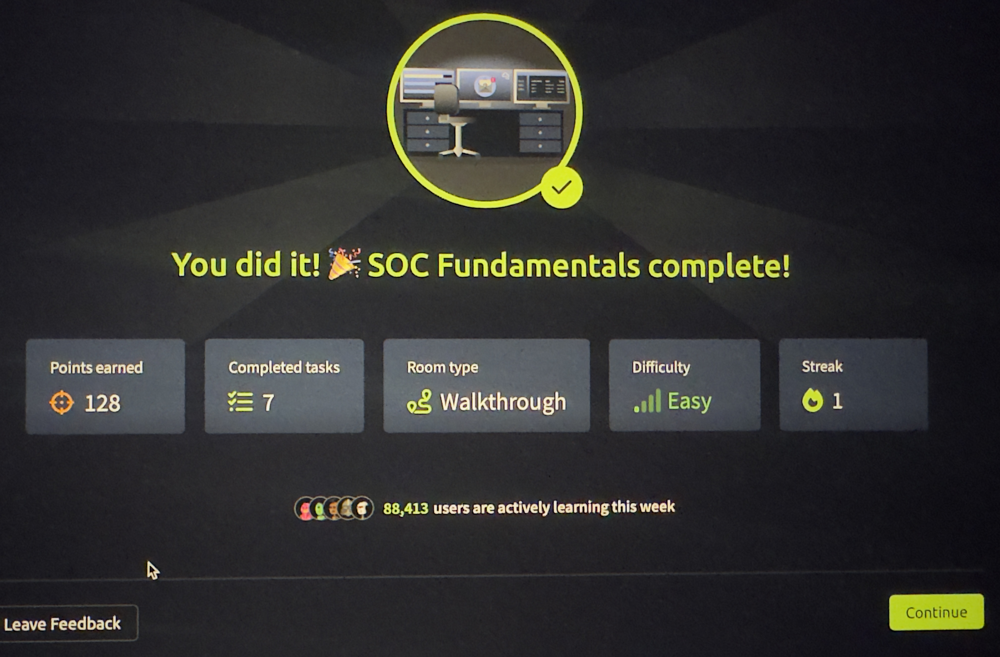

# SOC Fundamentals - TryHackMe Writeup

## Room Information
- **Difficulty:** Easy
- **Category:** SOC, Security Operations
- **Completed:** November 28, 2025

## Objective
This room introduces the fundamentals of Security Operations Centers (SOC), including the role of SOC analysts, common tools, and basic security monitoring concepts.

## Key Concepts Learned

### What is a SOC?
A Security Operations Center is a centralized unit that monitors, detects, analyzes, and responds to cybersecurity incidents. It operates 24/7 to protect an organization's assets.

### SOC Analyst Responsibilities
- Monitor security alerts and events
- Investigate potential security risk
- Respond to and contain security threats
- Document incidents and create proper reports
- Work with threat intelligence
- Maintain security tools and systems

### Common SOC Tools
- SIEM (Security Information and Event Management)
- IDS/IPS (Intrusion Detection/Prevention Systems)
- EDR (Endpoint Detection and Response)
- Firewall systems
- Log management tools

## Key Takeaways
- Understanding the structure and purpose of a SOC
- Learning the day-to-day responsibilities of a SOC Analyst Level 1
- Familiarity with essential SOC tools and technologies
- Importance of proper incident documentation

## Skills Demonstrated
- Understanding of security operations
- Knowledge of security monitoring concepts
- Familiarity with SOC workflows

## Completion Badge

Successfully completed the SOC fundamentals room on TryHackMe.